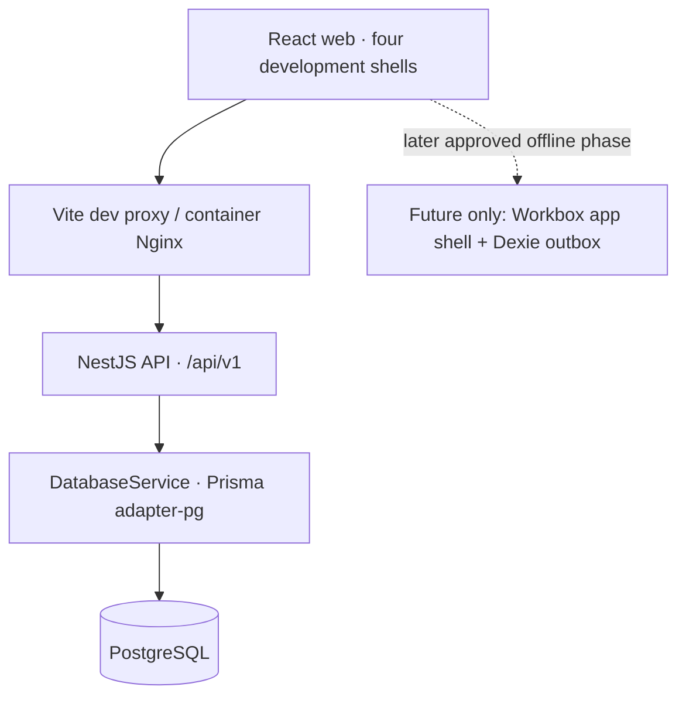

# Phase 2 architecture

The API is a modular monolith. AppModule loads validated environment configuration and HealthModule; HealthModule uses DatabaseModule. Future modules have empty reserved directories only. Health liveness does not query the database; readiness calls DatabaseService. No fake business endpoints exist.

Controllers transport requests; services own persistence and later domain decisions. `packages/shared` has schemas for health responses and safe error shape, not backend implementation. Global validation strips/rejects unrecognized DTO input, errors carry a generated request ID and do not reveal internal exceptions, CORS uses exact configured origins, and development logs omit request bodies, headers and query strings.

Production observability is deliberately small: startup logs, safe HTTP status/request IDs and independent liveness/readiness checks. Authentication, audit, tracing, metrics exporters and public deployment are deferred. UI role previews are not a security boundary.

The API container applies committed migrations before startup. PostgreSQL persists in a named volume. Web static files and API processes run as non-root users. Environment secrets are runtime inputs and excluded from build context; browser configuration contains only the public API prefix. The Docker web server reverse-proxies API requests so the internal hostname stays server-side.

Dependency installation uses a single workspace lockfile. Dockerfiles share identical dependency layers for build-cache reuse; the API deployment copies a production dependency closure with pnpm deploy. No unnecessary auxiliary services are introduced.

Implementation references: [Tailwind Vite integration](https://tailwindcss.com/docs/installation/using-vite), [Prisma 7 configuration and adapter changes](https://docs.prisma.io/docs/guides/upgrade-prisma-orm/v7). Locked package behavior is checked locally rather than assuming every latest major is compatible.
