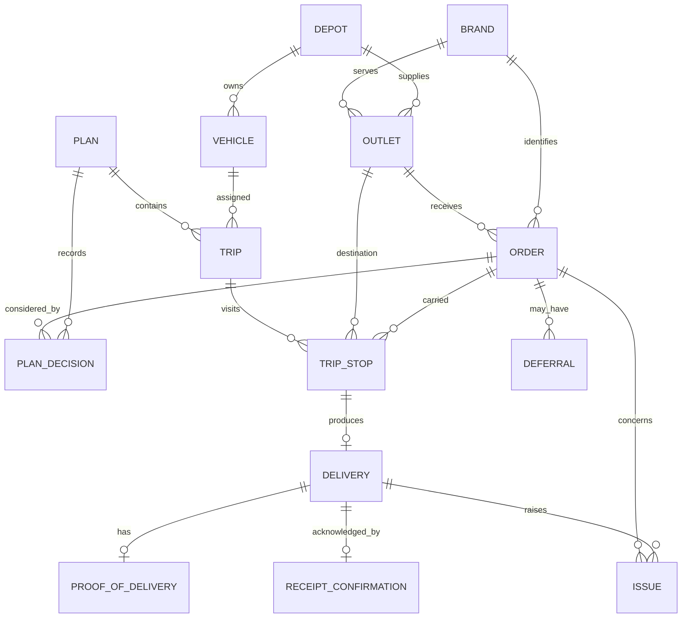

# Database foundation

The approved domain model is documented in the requirements verification and [Design Baseline](../design-baseline/08-states-and-flows.md). **No business schema is implemented in Phase 2.**

`apps/api/prisma/schema.prisma` contains the PostgreSQL datasource and client generator only. The baseline SQL migration executes `SELECT 1`; Prisma creates its own migration bookkeeping. There are no invented infrastructure columns, accounts, operational records, seeds or competition imports.

Prisma 7 uses `apps/api/prisma.config.ts` for CLI connection configuration and `@prisma/adapter-pg` in DatabaseService at runtime. `pnpm db:check` performs a real Prisma query; `/api/v1/health/ready` provides a safe service-level check. Generate the client with `pnpm db:generate` and apply committed migrations with `pnpm db:migrate`.

In a later approved phase, edit the schema, generate a named migration with the development command, inspect the SQL and commit migration history with the change. Do not use schema push/reset against existing data as an undocumented shortcut. Empty business schema is deliberate, not an incomplete seed failure.

# Database and domain model

Phase 3 introduces the relational foundation for the delivery operations
application. The schema is a design and implementation decision based on the
verified requirements and approved design baseline; it does not contain
official competition records.

## Domain map

Identity, role authorization, sync events and audit events are represented by
`User`, `SyncEvent` and `AuditEvent`. Loading and delivery events are append-only
operational history attached to a trip or delivery. `FuelUsage` is retained as
an accounting record for later allocation validation.

## Source identifiers

Reference entities (`Brand`, `Depot`, `Outlet`, `Vehicle`) have a required,
unique `sourceId`. Orders use a source ID plus requested delivery date as their
traceable natural key, allowing multiple orders for the same outlet and date.
Database IDs remain internal CUIDs. Importers must map source IDs explicitly and
must never use display names as identifiers.

## Precision and time

Weights, volumes, fuel efficiency and quotas use PostgreSQL `numeric` through
Prisma `Decimal` fields. Dates use `@db.Date`; event timestamps use `DateTime`.
Outlet window fields use PostgreSQL `time`. Application policy uses
`Asia/Colombo`; timestamp conversion and server-authoritative cutoff behavior
belong to the service layer in later phases.

## Delete and cascade strategy

Operational history references are generally `Restrict`, preventing accidental
loss of orders, plans, trips, deliveries, issues or receipts. User references
use `SetNull` so an account can be retired without deleting audit or event
history. Plan decisions are the one intentional `Cascade`: removing an
unpublished draft plan removes its decisions, while published plans and their
history are protected by the plan relations. Business feasibility rules are
not encoded as database constraints; domain services will validate them.

## Classification

- **OFFICIAL REQUIREMENT:** traceable source identifiers, multiple orders per
  outlet/date, capacity fields, temperature, operating calendar, planning,
  execution, receipt, issue, audit and synchronization foundations.
- **DESIGN DECISION:** CUID internal keys, enum values, plan versioning,
  append-only event records, restrictive historical relations, and the minimum
  structured proof-of-delivery fields.
- **OPTIONAL:** `FuelUsage` records are included as a foundation for the later
  fuel-quota validation engine; no fuel calculation is claimed in Phase 3.
- **DATATHON-ONLY RULE:** none of the model records are derived from or copied
  from competition datasets.

## Synthetic development data

Run `pnpm --filter @waypoint/api db:seed` after migrations. The seed is
idempotent and creates only `DEMO-*` records. Every seeded record is labelled:

`SYNTHETIC DEVELOPMENT DATA - NOT OFFICIAL COMPETITION DATA`

The seed is a local development fixture, not a claim that the competition
dataset requirement has been satisfied.

## Verification

The named migration is under
`apps/api/prisma/migrations/20260926091311_phase3_domain_model`. Phase 3 checks
include Prisma validation and generation, migration application, API
compilation, and two consecutive seed runs to verify idempotency. Constraint
and domain-service tests will be expanded in Phase 6 when allocation behavior
is implemented.

## Phase 6 capacity planning additions

Phase 6 adds additive planning evidence without changing the meaning of existing
orders, allocations or published plans:

- `PlanValidation` records validation status and blocking/advisory findings for
  a specific plan version. A later result does not overwrite earlier history.
- `PlanCapacitySnapshot` captures vehicle capability, availability,
  weight/volume limits and fuel reservation used during plan review. These are
  snapshots, not mutable vehicle master data.
- `CapacityPlanningScenario` stores explicitly sourced future-volume assumptions
  by depot, brand and ISO week. The database rejects negative volumes and a
  chilled volume greater than total volume. Synthetic fixtures use a
  `DEMO-ILLUSTRATIVE-SCENARIO` source label and are not forecasts.

The migration is additive and uses restrictive foreign keys. Existing Phase 3–5
rows remain valid; deleting a referenced plan, vehicle, depot or brand is blocked
while planning evidence exists. Feasibility rules such as refrigeration,
delivery windows, route limits and fuel calculations remain service-layer rules.
